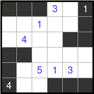
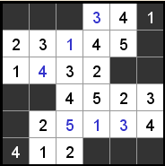

# STRAIGTS SOLVER LISP

## ALUNOS
  André Filipe da Silva Fernandes - 19100515
  
  Hans Buss Heidemann - 19100528

Link youtube: https://youtu.be/2xTltlfR8qo

## O PROBLEMA
  Escolhemos o puzzle Straights para implementar uma solução. O jogo consiste em um tabuleiro quadrado com casas brancas e pretas. Algumas dessas casas possuem números iniciais, e nosso objetivo é preencher o restante das casas brancas de forma que nenhuma linha
  ou coluna possua números repetidos e que cada tira contínua de números possua números em sequência, mesmo que estejam fora de ordem, por exemplo [4,1,3,2] é uma sequência válida, enquanto [4,1,5,2] não.


## SOLUÇÃO
  A estratégia utilizada para resolver o puzzle foi através do método de backtrack, em que as soluções são testadas a exaustão até que uma configuração válida apareça, e soluções inválidas são descartadas. 

  É possível imaginar os tabuleiros possíveis como uma árvore, com o tabuleiro inicial no topo e cada variação se ramifica a partir deste, então o método é uma busca em profundidade por configurações válidas. 
  
  Pensar no problema como uma árvore de possibilidades é particularmente útil ao trabalhar com linguagens funcionais dada a afinidade de árvores com algoritmos recursivos. 


## DETALHES DE IMPLEMENTAÇÂO
  A implementação foi semelhante à versão feita em Haskell, nosso tabuleiro, por simplicidade, é uma lista com todos os elementos em ordem de leitura, da esquerda para a direita, de cima para baixo. 

  O programa possui uma seção só com funções auxiliares utilizadas para facilitar o acesso a listas, isolar trechos, substituir valores, verificar valores repetidos etc. Como é o caso de "steps", "slice", "repeated", etc. 

  Um outro trecho é dedicado a funções para tratar listas como matrizes. Já que como mencionado anteriormente, nosso tabuleiro é uma lista, e não uma matriz propriamente dita. Como é o caso de "get_row" e "get_col". 

  O terceiro trecho é dedicado a funções úteis para o tabuleiro e solução de fato, por exemplo identificar as casas, extrair tiras de um trecho qualquer, verificar se a tira obtida é contínua, validar coordenadas e aplicar o algoritmo de backtrack.

  Por último tem o trecho de print, com funções que retornam uma string pronta para mostrar mostrar o resultado na tela, como é o caso de "show_board" e "show_solution". 


I
## COMO UTILIZAR
  Para definir o tabuleiro desejado o usuário deve substituir, dentro do código na função create_board, a variavel size, com o tamanho do tabuleiro e a variavel board, com os elementos em sequência. 

  Os valores seguem as seugintes regras: 
  - Espaço vazios em casas brancas são representados pelo número 0
  
  - Espaços vazios em casas pretas são representados por x
  
  - Casas brancas numeradas são representadas apenas escrevendo o número desejado
  
  - E por fim, casas pretas numeradas são representadas escrevendo o valor negativo do número desejado.

  Por exemplo o tabuleiro abaixo pode ser representado da seguinte forma:

  

  ```
  (defun create_board()
      (setq board   '(x  x  x  3  0 -1
                      0  0  1  0  0  x
                      0  4  0  0  x  x
                      x  x  0  0  0  0 
                      x  0  5  1  3  0
                    -4  0  0  x  x  x)
      )
      (setq size 6)
  )
  ```

Após compilar e executar o programa o resultado será printado na tela seguindo da seguinte maneira:
- Espaços vazios em casas pretas são representados por [X]

- Casas brancas numeradas são representadas simplesmente pelo número correspondente

- Casas negras numeradas são representadas com o número entre colchetes, por exemplo [7].

Se o tabuleiro não possuir nenhuma função válida, nada será mostrado.


A solução do tabuleiro mostrado anteriormente será a seguinte:



```
$ clisp str8ts.lisp
[X][X][X] 3  4 [1]
 2  3  1  4  5 [X]
 1  4  3  2 [X][X]
[X][X] 4  5  2  3 
[X] 2  5  1  3  4 
[4] 1  2 [X][X][X]
```

## Organização do grupo

Primeiro selecionamos as funções que cada um estaria responsavel por traduzir, após isso começamos o trabalho sinalizando em que funções estavamos tendo dificuldades em implementar pelas diferenças com Haskell, para resolver essas funções nós juntamos no discord e começamos a implementar funções não nativas para solucionar o problema. Os testes foram realizados sempre por um integrante do grupo em um interpretador online e depois validados por outro integrante com o Clisp.
Após a finalização da implementação do trabalho, nos dividimos entre um editar o vídeo da apresentação e o outro estar realizando a escrita do relátorio.


## Dificuldades encontradas e diferenças a Haskell

Neste trabalho encontramos pouca dificuldade em relação ao trabalho relaziado em Haskell, como já tinhamos conhecimento sobre a implementação do algoritmo para resolver, somente tivemos que estar traduzindo o resolver para o LISP. Achamos o LISP muito mais consistente e com uma curva de aprendizado mais facil do que em relação ao Haskell, a grande quantidade de parenteses usados pela linguagem dificulta um pouco o entendimento do programa em editores que não tem suporte, mas nada impossivel de se sobreviver.

Tivemos alguns problemas nos testes iniciais com LISP pois notamos que os programas são rodadas de uma forma muito lenta, principalmente da forma interpretada e para casos grandes chega a quase nao ser aceitavel, rodando o programa compilado conseguimos resultados mais rápidos.

Tivemos dificuldade também em algumas funções de LISP que funcionam de forma diferente em haskell, como a função Concate, que precisamos estar implementando uma versão propria nossa, mas também utilizamos outras funções nativas como o map e o dotimes, que acreditamos serem mais otimizados do que as criadas por nos próprias.
